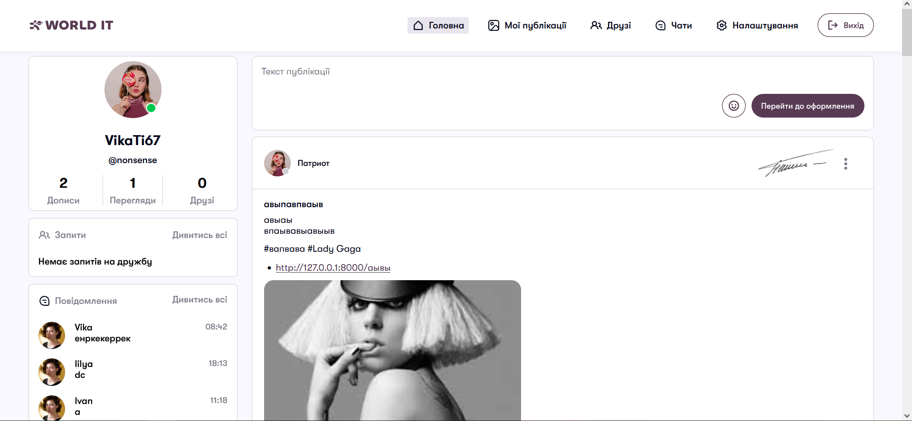
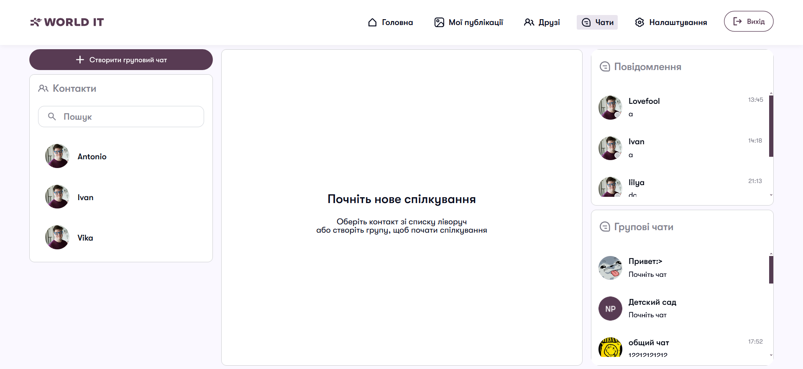
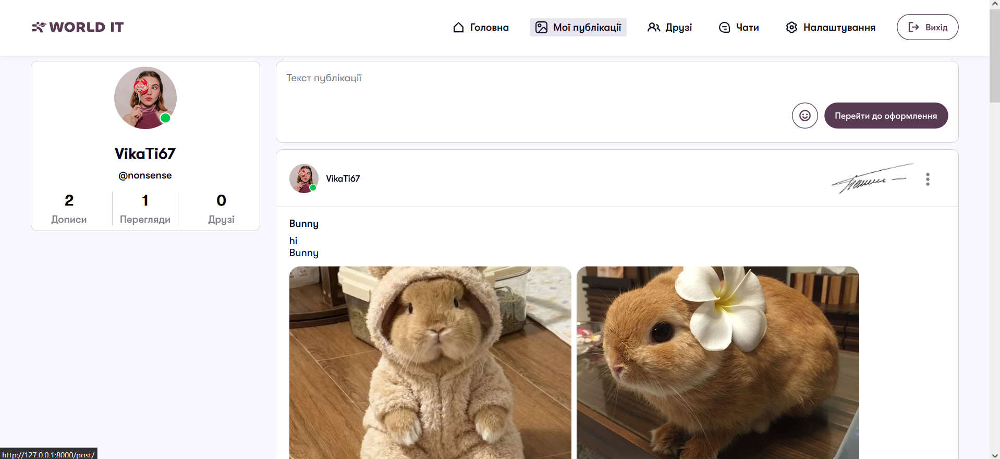
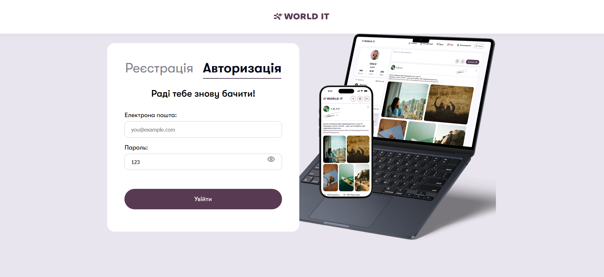

<h1 style="text-align:center;">Соціальна мережа WorldIT</h1>

<h2 id = "#goals"> 🎯 Цей проєкт створено з метами :</h2>
<ul>
    <li>Роботи з використанням фреймворку Django, </li>
    <li>Практики з frontend-розробки за допомогою мов HTML, CSS та JS, </li>
    <li>Вивчення та використання протоколу Websocket, </li>
</ul>

<h2 id = "team"> 👥 Склад команди розробників проєкту : </h2>
<ul>
    <li><a href="https://github.com/Vi1704ca">Тимошенко Вікторія</a> — Team Lead / Програміст</li>
    <li><a href="https://github.com/AnikinIvan">Анікін Іван</a> — Програміст</li>
    <li><a href="https://github.com/Remsha-Illia">Ремша Ілля</a> — Програміст</li>
</ul>

<h2> 🧭 Навігація / зміст файлу : </h2>
<ul>
    <li><a href="#goals">Мети проєкту</a></li>
    <li><a href="#team">Склад команди</a></li>
    <li>Використані технології</li>
    <li><a href="#project-launch">Запуск проєкту</a></li>
    <li>Додатки та їх роль у проєкті</li>
    <li>  Висновок </li>
</ul>

<h2 id = "technologies"> ⚒️ Використані технології : </h2>
<ul>
    <li><a href="https://developer.mozilla.org/en-US/docs/Web/API/WebSockets_API">WebSocket</a></li>
    <li><a href="https://channels.readthedocs.io/">Django Channels</a></li>
    <li><a href="https://github.com/django/daphne">Daphne</a></li>
    <li><a href="https://pillow.readthedocs.io/">Pillow</a></li>
</ul>

<h2 id = "project-launch"> 📂 Розгортання проєкту :</h2>
<h3>Клонування проєкту : </h3>
<pre><code>git clone https://github.com/Vi1704ca/SocialNetwork_Diploma.git</code></pre>
<h3>Створення віртуального оточення :</h3>

Для Windows : 

<pre><code> python -m venv venv
    source venv/Scripts/activate </code></pre>

Для MacOS / Linux : 

<pre><code> python3 -m venv venv
    source venv/bin/activate </code></pre>

Встановлення модулів : 

<pre><code>pip install -r requirements.txt</code></pre>

Запуск проєкту : 

<pre><code>python manage.py runserver</code></pre>

<h2 id = "apps"> ⚙️ Додатки та їх роль у проєкті : </h2>
<ul>
    <li>social_network - основний додаток проєкту - містить єдиний файл налаштувань.</li>
    <li>settings_app - додаток, що містить сторінки налаштувань користувача.</li>
    <li>core_app -  the site's main page with all the posts
          
        
    </li>
    <li>chat_app - додаток, що містить сторінки чатів та їх створення.
          
        
    </li>
    <li>post_app - додаток, що містить сторінки постів та їх створення.
          
        
    </li>
    <li>user_app - додаток, що містить сторінку реестрації / авторизації та рекомендованих користувачів. 
          
        
    </li>
</ul>
 <!-- КАРТИИНКА -->

<h2 id = "summary">Висновок : </h2>

Цей проєкт був створений виключно з навчальною метою заради вивчення нових технологій, та практиці з вже відомими ресурсами.

<h1 style="text-align:center;">WorldIT Social Network</h1>

<h2 id = "goals"> 🎯 This project was created with the following goals:</h2>
<ul>
    <li>Working with the Django framework,</li>
    <li>Practicing frontend development using HTML, CSS, and JS languages,</li>
    <li>Learning and utilizing the WebSocket protocol,</li>
</ul>

<h2 id = "team"> 👥 Project Development Team: </h2>
<ul>
    <li><a href="https://github.com/Vi1704ca">Viktoriia Tymoshenko</a> — Team Lead / Programmer</li>
    <li><a href="https://github.com/AnikinIvan">Ivan Anikin</a> — Programmer</li>
    <li><a href="https://github.com/Remsha-Illia">Illya Remsha</a> — Programmer</li>
</ul>

<h2> 🧭 File Navigation / Table of Contents: </h2>
<ul>
    <li><a href="#goals">Project Goals</a></li>
    <li><a href="#team">Development Team</a></li>
    <li><a href="#technologies">Technologies Used</a></li>
    <li><a href="#project-launch">Project Launch</a></li>
    <li><a href="#apps">Applications and Their Role</a></li>
    <li><a href="#summary">Conclusion</a> </li>
</ul>

<h2 id = "technologies"> ⚒️ Technologies Used: </h2>
<ul>
    <li><a href="https://developer.mozilla.org/en-US/docs/Web/API/WebSockets_API">WebSocket</a></li>
    <li><a href="https://channels.readthedocs.io/">Django Channels</a></li>
    <li><a href="https://github.com/django/daphne">Daphne</a></li>
    <li><a href="https://pillow.readthedocs.io/">Pillow</a></li>
</ul>

<h2 id = "project-launch"> 📂 Project Deployment:</h2>
<h3>Cloning the project: </h3>
<pre><code>git clone https://github.com/Vi1704ca/SocialNetwork_Diploma.git</code></pre>
<h3>Creating a virtual environment:</h3>

For Windows: 

<pre><code> python -m venv venv
    source venv/Scripts/activate </code></pre>

For MacOS / Linux: 

<pre><code> python3 -m venv venv
    source venv/bin/activate </code></pre>

Installing modules: 

<pre><code>pip install -r requirements.txt</code></pre>

Running the project: 

<pre><code>python manage.py runserver</code></pre>

<h2 id = "apps"> ⚙️ Applications and Their Role in the Project: </h2>
<ul>
    <li>social_network - the main application of the project - contains the single settings file.</li>
    <li>settings_app - application containing user settings pages.</li>
    <li>core_app -  the site's main page with all the posts
          
        
    </li>
    <li>chat_app - application containing chat pages and their creation.
          
        
    </li>
    <li>post_app - application containing post pages and their creation.
          
        
    </li>
    <li>user_app - application containing registration / authorization page and recommended users. 
          
        
    </li>
</ul>

<h2 id = "summary">Conclusion: </h2>

This project was created exclusively for educational purposes to study new technologies and practice with already known resources.
